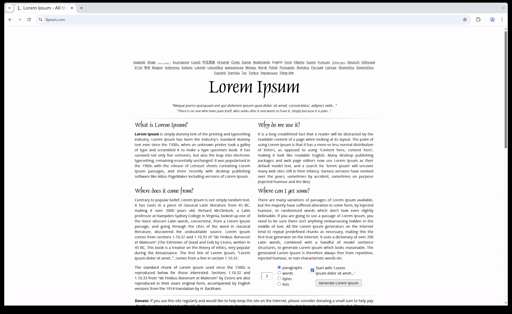

# DinoeufDePâques

This is an extremely bare-bones implementation of the "dinosaur game", intended
to be very easy and convenient to dynamically include in other codebases, with
the purpose of being used as an easter egg in other programs.

To allow for a single, small (less than 6kB minified, less than 3kB gzipped), js
bundle and nothing else, images (in the `webp` format) are directly embedded
inside the browser-ready and small bundle (./build/dinoeufdepaques.js) as base64
strings.

For now the game is minimal, quickly done in a simple and sometimes hacky way.
It's also not really that fun yet, but it works and it fills its ambition of an
easter egg, so to me it's ready!

## How to rely on this

The bundle is available in the `bundles` directory. Just include the code in
your codebase and the dino game will appear on top of your page.

## Controls

For now, it only has a single possible action: "jumping". It can be done by
either:

- pushing any key with one of the following `keyCode`: `13` (Enter), `32`
  (space) and `38` (up). Those key codes have been selected based on what
  I observed professionaly as frequently available ones on non-desktop
  web-enabled devices (e.g. game consoles, smart TVs etc.)

- clicking on the game

To quit the game and free all of its resources, just press "left" (or `keyCode`
`37`).

## Note about the code being too french

I added as a personal challenge the idea of declaring variables and function
names in french - which isn't really a thing even in france. It makes
development, funnily enough, harder even for a french person.
